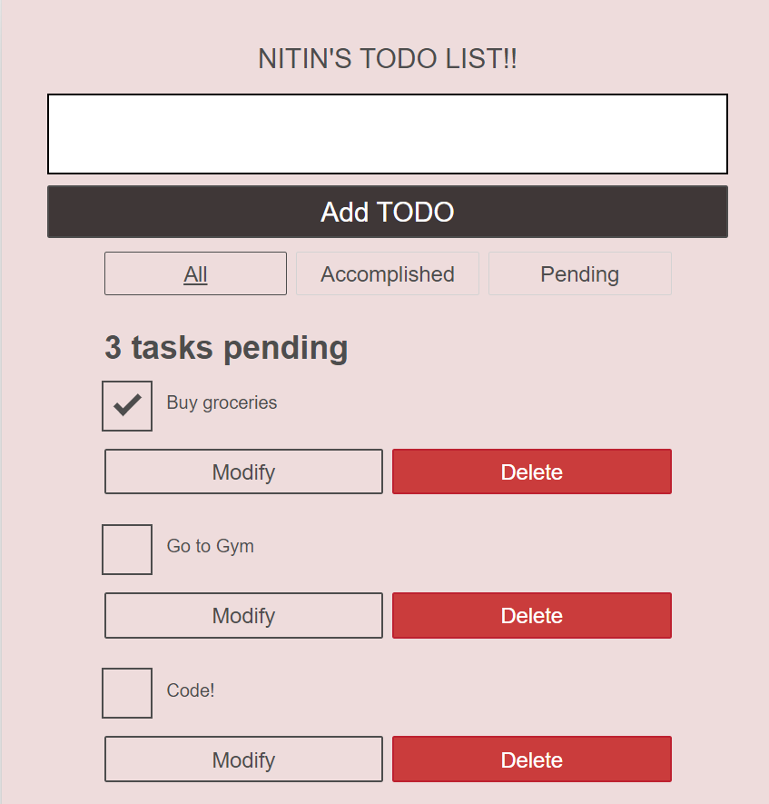

## Getting Started

1. Clone or download the project.
2. To run the application, cd to the project directory and run the following commands:

```
$ npm install
$ npm start
```

## Prerequisites

You will need the alpha build of React as this feature is still in alpha (as at the time of writing this article). You also need NPM and Node.js installed locally.

## Built With

[React]("https://reactjs.org/") - JavaScript framework.
